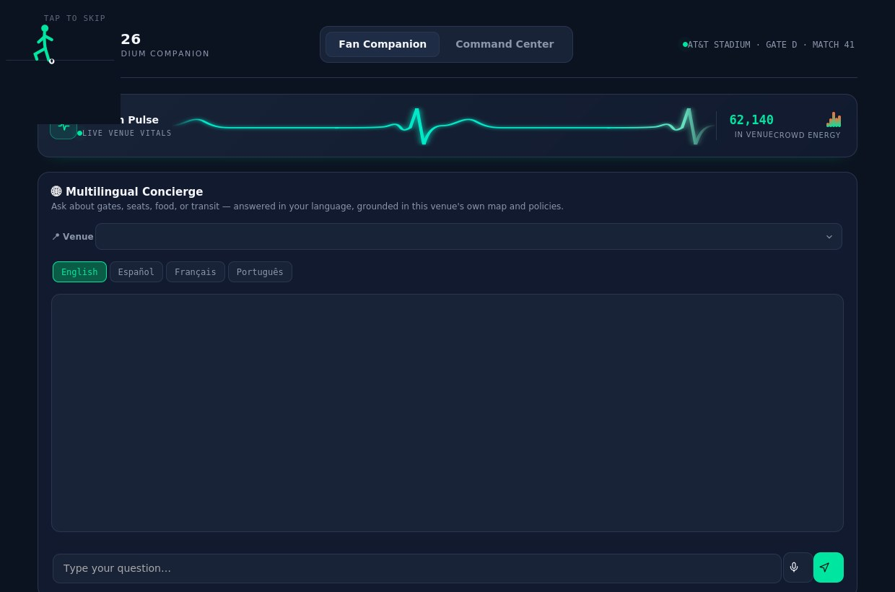
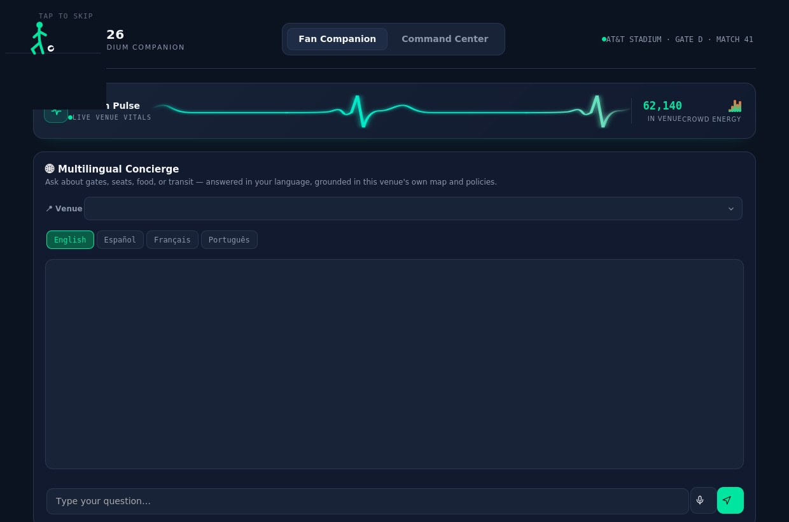
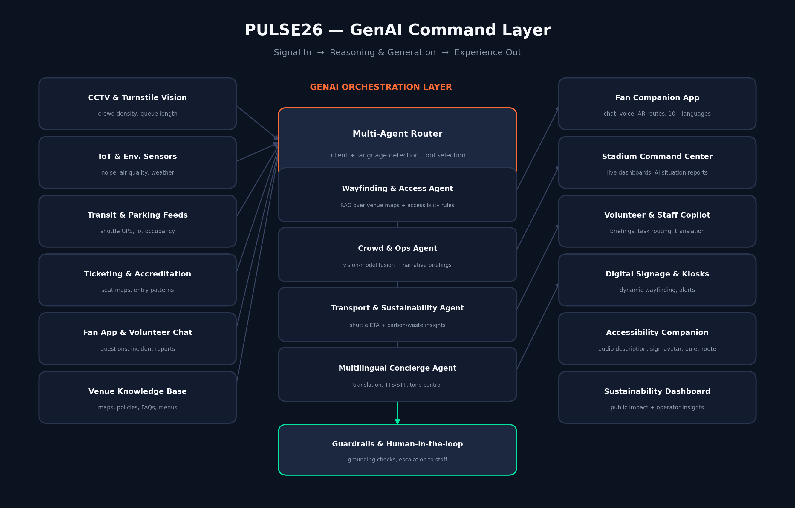

<div align="center">

# 🏟️ PULSE26
### A GenAI Command Layer for FIFA World Cup 2026 Stadium Operations

**Navigation · Crowd Management · Accessibility · Transportation · Sustainability · Multilingual Assistance · Operational Intelligence · Real-Time Decision Support**

[](LICENSE)
[](#)
[](#-genai-techniques)
[](#)

[**🚀 Try the Live Demo**](#-live-demo) · [**📄 Full Proposal (PDF)**](docs/PULSE26_Solution_Proposal.pdf) · [**🧭 Architecture**](#-architecture)

</div>

---

## 📌 Overview

PULSE26 is a GenAI orchestration layer that sits across a FIFA World Cup 2026 host stadium's existing sensors, ticketing systems, transit feeds, and staff channels — turning raw operational data into plain-language guidance for **fans, volunteers, venue staff, and tournament organizers**, all at once.

Instead of one generic chatbot, PULSE26 is a small team of purpose-built AI agents — **wayfinding, crowd & operations, transportation & sustainability, and multilingual concierge** — coordinated by a router agent and grounded by retrieval over each venue's own maps, policies, and live signals.

> 🌍 Built for the largest World Cup ever staged — 48 teams, 104 matches, 16 host cities across the USA, Canada, and Mexico.

---

## 🧩 The Problem

| Pain point | Why it matters at World Cup 2026 scale |
|---|---|
| 🗣️ **Language barriers** | Fans from dozens of countries need quick, accurate answers in their own language |
| 🚧 **Crowd bottlenecks** | Gate, concourse, and transit-hub congestion is usually noticed *after* it forms |
| ♿ **Inconsistent accessibility support** | Step-free routing, sensory-friendly paths, and sign-language content vary by venue |
| 👷 **Under-trained volunteers** | Tens of thousands of volunteers, trained in days, need instant and reliable answers |
| 🌱 **Untracked sustainability goals** | Waste, water, and transit-emissions data is hard to surface live |
| 🧠 **Manual situational awareness** | Organizers fuse video, sensor, and transit signals into one picture by hand |

---

## ✅ The Solution — 8 GenAI-Powered Modules

| # | Module | Category | What it does |
|---|---|---|---|
| 1 | 🧭 **Navigation & Wayfinding Assistant** | Navigation | Turns a static venue map into a live, personalized, regenerating route (RAG over floor plans + congestion data) |
| 2 | 📡 **Crowd Management & Predictive Flow** | Crowd management | Fuses vision-model density signals into plain-language briefs for control-room staff, before bottlenecks form |
| 3 | ♿ **Accessibility Companion** | Accessibility | Step-free routing, on-demand audio description, and an AI sign-language avatar for announcements |
| 4 | 🚌 **Smart Transportation Planner** | Transportation | Blends shuttle, rideshare, transit, and parking data into one conversational planner |
| 5 | 🌱 **Sustainability Intelligence** | Sustainability | Auto-generates plain-language summaries of waste, water, and emissions data for the public and operators |
| 6 | 🌐 **Multilingual Fan Concierge** | Multilingual assistance | Chat + voice assistant tuned to matchday vocabulary across the tournament's most common fan languages |
| 7 | 👷 **Volunteer & Staff Copilot** | Operational intelligence | Instant, grounded answers from the venue's own ops manual; auto-summarized incident reports |
| 8 | 🧠 **Real-Time Decision Support** | Real-time decision support | A command-center view that fuses every module into one refreshed narrative situation report |

📄 Full detail on every module, the GenAI techniques behind them, personas, roadmap, KPIs, and risk mitigations is in the **[Solution Proposal (PDF)](docs/PULSE26_Solution_Proposal.pdf)** / **[.docx](docs/PULSE26_Solution_Proposal.docx)**.

---

## 🚀 Live Demo

The `/demo` folder is a **self-contained, interactive HTML prototype** — no build step, no dependencies, works straight in a browser.

### Run it locally
```bash
git clone https://github.com/<your-username>/<your-repo>.git
cd <your-repo>/demo
open index.html      # macOS
# or just double-click index.html / drag it into a browser tab
```

### Or view it instantly with GitHub Pages
1. Go to your repo's **Settings → Pages**
2. Set **Source** to `main` branch, `/demo` folder
3. Your live link will be `https://<your-username>.github.io/<your-repo>/`

### What's inside the prototype
- 🎬 A short animated intro (kick-off themed reveal — click/tap anywhere to skip)
- 🌐 A **multilingual concierge chat** (English / Español / Français / Português) that answers gate, seat, food, transit, live-score, and stadium-rule questions, grounded per-venue
- 📍 A **venue selector** across all 16 real FIFA World Cup 2026 stadiums, driven by [`data/stadiums.json`](data/stadiums.json) — a small dataset of real venue names, FIFA tournament names, cities, capacities, and facts (see [Dataset](#-dataset) below) — with currency-aware pricing (USD / CAD / MXN)
- 🎙️ **Real voice input** via the Web Speech API, with a microphone-permission control
- 🧭 A live-regenerating **wayfinding route card** + accessibility toggles (step-free routing, audio description, sign-language avatar, low-sensory mode)
- 📊 A **Command Center** view: animated crowd-pulse monitor, zone density grid, an auto-generated AI situation briefing, live alerts, shuttle ETAs, and a sustainability snapshot

<table>
<tr>
<td width="50%"><br/><sub align="center">Fan Companion — multilingual concierge + wayfinding</sub></td>
<td width="50%"><br/><sub align="center">Command Center — live crowd, alerts & sustainability</sub></td>
</tr>
</table>

> All data shown in the prototype (attendance, alerts, scores, prices) is **simulated for demonstration purposes**.

---

## 🗂️ Dataset

[`data/stadiums.json`](data/stadiums.json) holds the real 16 host venues for FIFA World Cup 2026, sourced from FIFA.com and official host-city sites:

```json
{
  "id": "dallas",
  "commonName": "AT&T Stadium",
  "fifaName": "Dallas Stadium",
  "city": "Arlington (Dallas), TX",
  "country": "USA",
  "capacityApprox": "~80,000",
  "currency": "usd",
  "opened": 2009,
  "roof": "retractable",
  "fact": "It hosts more matches than any other 2026 venue — nine, including a semifinal.",
  "matchesHosted": 9
}
```

A few things worth knowing about the data:
- **`fifaName`** is the neutral name FIFA requires in place of a corporate sponsor name during the tournament (e.g. AT&T Stadium → *Dallas Stadium*, SoFi Stadium → *Los Angeles Stadium*, MetLife Stadium → *New York New Jersey Stadium*). It's `null` where a venue's own name was already neutral and unchanged (Estadio Azteca, Estadio Akron, Estadio BBVA, BC Place).
- **Capacities are approximate** tournament-configuration figures — they vary slightly by source and seating setup, so the UI always labels them "approx."
- The demo's chat, venue selector, and wayfinding logic all read from this one dataset (embedded inline in `demo/index.html` for a dependency-free single-file prototype, mirrored here as standalone JSON for transparency and reuse). Update the JSON and every chat reply, capacity fact, and price stays in sync — nothing about a specific venue is hardcoded into a chat bubble.

---

## 🧠 Architecture

<div align="center">

</div>

Live signals (CCTV/turnstile vision, IoT sensors, transit & parking feeds, ticketing, fan/volunteer chat, venue knowledge base) flow into a **multi-agent GenAI orchestration layer**. A router agent detects intent and language, then delegates to specialist agents — wayfinding, crowd & ops, transport & sustainability, multilingual concierge — all under a **guardrail layer that keeps a human in the loop** for anything safety-critical. Results are published to fan apps, the command center, staff copilots, digital signage, and public dashboards.

---

## 🛠️ GenAI Techniques

| Technique | Where it's used | Why generative AI (not a fixed rules engine) |
|---|---|---|
| **Retrieval-Augmented Generation (RAG)** | Wayfinding, staff copilot, concierge | Answers stay grounded in each venue's own maps and policies, updating the moment source documents change |
| **Multi-agent orchestration** | Router agent + specialist agents | Each domain (transport, accessibility, crowd) gets a focused agent instead of one overloaded prompt |
| **Multimodal fusion (vision + language)** | Crowd management, decision support | Turns camera/sensor numbers into a narrative a human can act on in seconds |
| **Function calling / tool use** | Transportation planner, signage updates | Lets the model query live systems (shuttle GPS, parking counts) instead of guessing |
| **Speech-to-text / text-to-speech** | Multilingual concierge, accessibility | Removes the literacy/typing barrier for voice-first or visually impaired fans |
| **Generative summarization** | Sustainability, incident reports, briefings | Condenses large operational data streams into something a person can read in one glance |

---

## 📁 Project Structure

```
pulse26/
├── README.md                              ← you are here
├── LICENSE
├── demo/
│   └── index.html                         ← interactive prototype (open directly, or serve via GitHub Pages)
├── data/
│   └── stadiums.json                      ← real FIFA World Cup 2026 venue dataset (see Dataset section)
└── docs/
    ├── architecture.png                   ← reference architecture diagram
    ├── PULSE26_Solution_Proposal.pdf       ← full written proposal
    ├── PULSE26_Solution_Proposal.docx      ← editable version
    └── screenshots/
        ├── fan-companion.jpg
        └── command-center.jpg
```

---

## 🗺️ Roadmap

- **Phase 1 — Foundation:** stand up per-venue RAG knowledge base; integrate read-only CCTV/ticketing/transit feeds; ship multilingual concierge + wayfinding
- **Phase 2 — Operational Intelligence:** launch crowd/ops agent + command center at a pilot venue; add volunteer/staff copilot; run live-match simulations
- **Phase 3 — Full Experience & Scale:** add accessibility companion + sustainability dashboard; roll out to all 16 host venues; finalize human-in-the-loop escalation paths

Full detail in the [Solution Proposal](docs/PULSE26_Solution_Proposal.pdf).

---

## 📊 Illustrative Impact Metrics

| Category | KPI |
|---|---|
| Navigation | ↓ average time-to-seat and staff-directed wayfinding requests |
| Crowd management | ↑ bottlenecks flagged *before* exceeding a safe density threshold |
| Accessibility | ↓ staff-assisted requests for fans in accessibility mode |
| Multilingual support | ↑ share of queries resolved without staff escalation, by language |
| Transportation | ↓ post-match departure clearance time |
| Sustainability | ↑ refill-station usage and recycling diversion rate |
| Decision support | ↓ time from anomaly detection to organizer action |

---

## ⚠️ Disclaimer

PULSE26 is a **conceptual hackathon prototype**. Attendance figures, alerts, live scores, and prices in the demo are simulated for illustration. Stadium capacities are approximate tournament-configuration figures. This is not an official FIFA or Anthropic product.

## 📄 License

Released under the [MIT License](LICENSE).
